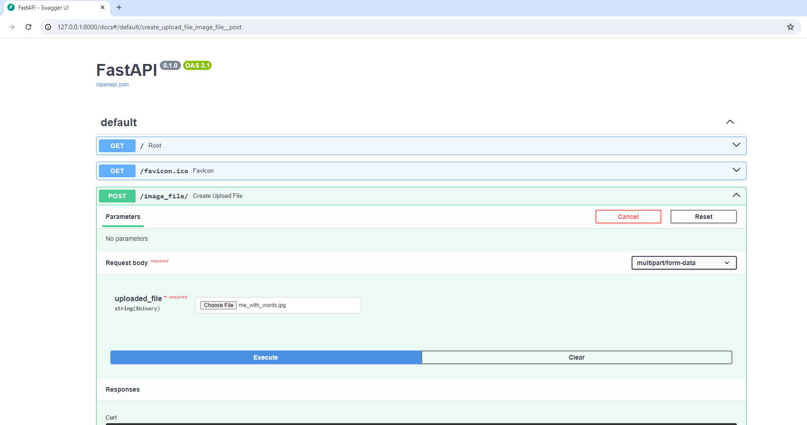
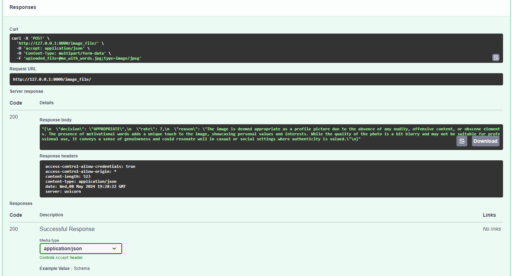

# Profile Picture Checker

The purpose of this application is to allow users to manually upload a photo, after which the program will determine if it is appropriate or inappropriate for a profile picture, following the guidelines of popular social media platforms.

It was developed using Python and FastAPI, and using OpenAI’s APIs. 

# How to run the program

I have used Python v3.12.0 (Virtual Environment Mode)

So first you have to clone this repository. Then pip install the requirements.

-  https://github.com/regieosano/dating-profile-review.git

-  pip install -r requirements.txt

-  Provide your own OPENAI_API_KEY in the .env file

-  For OpenAIs APIs Here's the link below:
   (I particularly use the Completion APIs)

-  https://platform.openai.com/docs/api-reference/introduction

# Execution of the program

Using FastAPI built-in Swagger you can try and execute the image file uploaded.

Sample Response.

# Algorithm of the Application

As a committed advocate for LEAN MANAGEMENT and the principle of avoiding over-engineering, I also embrace established software development best practices. These include adhering to the philosophy of "Don't Reinvent the Wheel," the DRY (Don't Repeat Yourself) Principle, and the KISS (Keep It Simple, Stupid 😁) method.

Here is the algorithm I propose: (to be continued)

